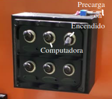
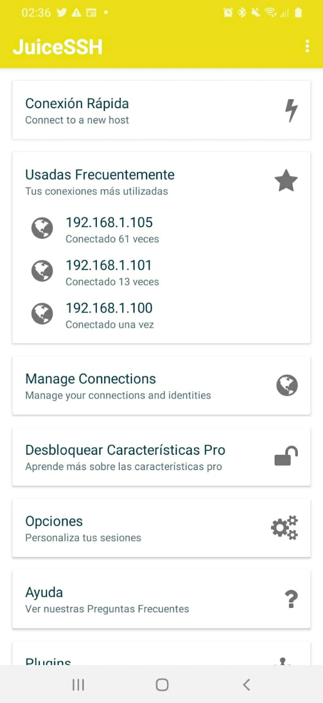
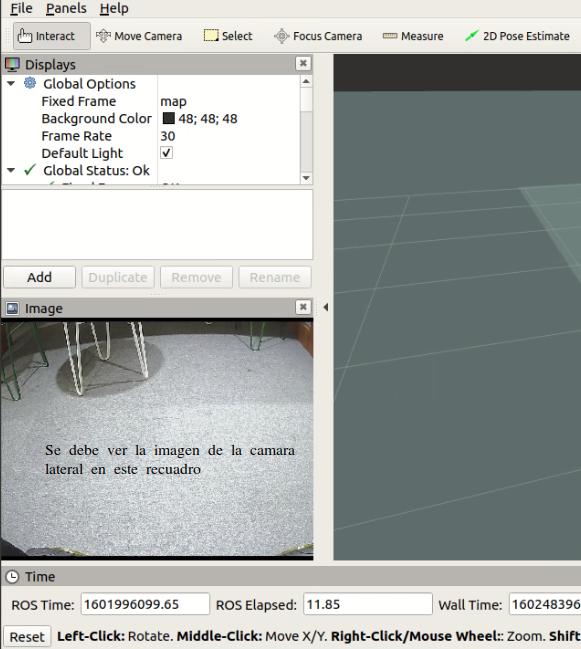
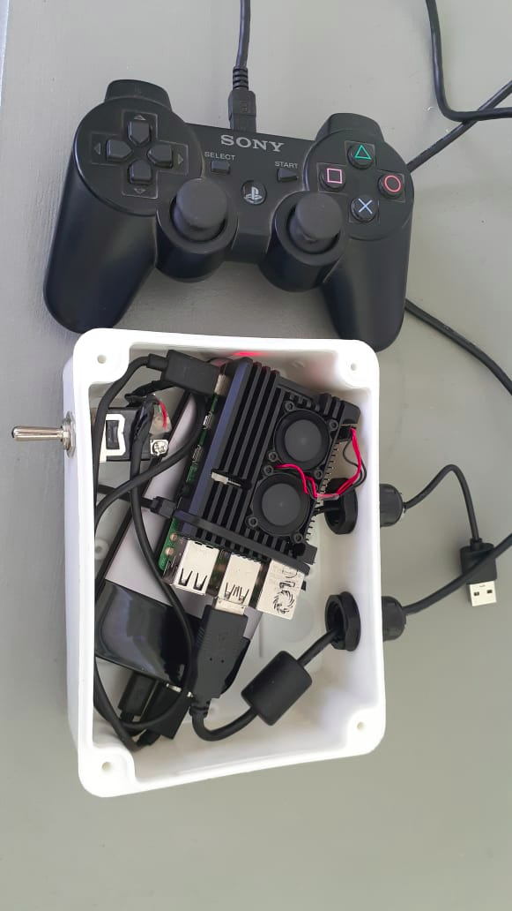
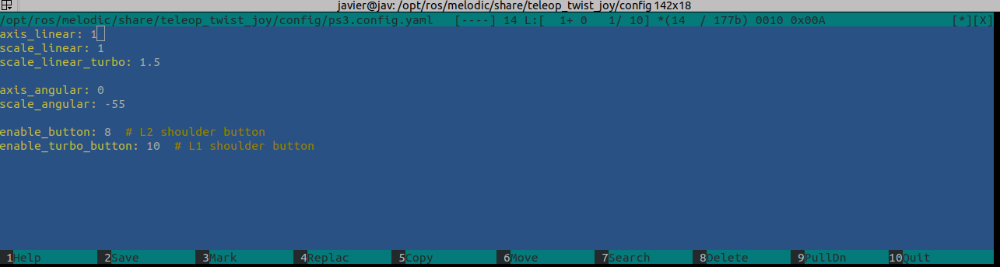

.. gbot_seeds_v1 documentation master file, created by
   sphinx-quickstart on Sat Dec 12 00:04:09 2020.
   You can adapt this file completely to your liking, but it should at least
   contain the root `toctree` directive.

Documentación gbot_seeds
=========================================
Manual de funcionamiento y utilización del sistema

.. toctree::
   :maxdepth: 2
   :caption: Contents:

.. image:: ../source/2_.png

.. contents:: Contenido de este documento
   :depth: 4

**************************************
Pasos a seguir para iniciar el sistema
**************************************

El robot debe encenderse primero siguiendo los pasos que se detallan en encendido del robot.
Una ves completado los pasos del encendido del robot puede iniciarse el encendido del joystick. Se deben respetar estos pasos si se quiere iniciar correctamente los nodos del sistema

**************************************
Encendido Robot
**************************************

IMPORTANTE
------------

Para encender el robot es necesario, NO OLVIDAR, prender la pequeña llave de precarga que se encuentra en la parte superior de la caja de encendido. Esta palanca se encuentra apagada cuando apunta hacia la caja.

-Verificar que el dock USB se encuentra apagado, si la salida que va hacia la cámara USB esta prendida el sistema puede no iniciar de forma correcta

1. Encender la llave de precarga del robot, la palanca deberá quedar apuntando hacia afuera. lo que indica que esta prendida (apunta hacia la caja cuando esta apagada)

2. Encender llave de alimentación general (arriba a la derecha)

3. Encender computadora y espera 30 segundos aproximadamente.

4. Encender resto de las llaves 

5. Encender interruptor cámara RGB

IMPORTANTE
----------

La llave de encendido de alimentación (arriba a la derecha) tiene posición invertida respecto del resto, con lo cual estará encendida cuando apunta hacia abajo. El resto de las llaves estarán encendidas cuando apuntan hacia abajo (sentido inverso)

**********************************************
Conectarse remotamente al robot usando celular
**********************************************

1. Desconectar los datos del teléfono

2. Conectarse al wifi **gbot_seeds**, la contraseña es **semilleros**

3. Abrir la aplicación de android JuiceSSH y conectarse a la **IP:192.168.1.105** como root, contraseña: **odroid**

   Si no esta cargada la conexión se debe seleccionar en conexión rápida y entrar, sino puede utilizarse del menu de las recientes utilizadas

4. ejecutar el comando:

::

  sudo systemctl stop robot.service
  sudo systemctl start robot.service

Estos comandos si funcionan correctamente no deberian devolver ninguna salida

5. Esperar 30 segundos a que inicie el sistema ROS del robot. Puede chequear si el sistema inicio correctamente tipeando en la cosola
   
::
  
  rostopic list

Deben aparecer una lista de topic, si algo no funciono correctamente puede aparece el mensaje **UNABLE TO CONNECT WITH ROS MASTER NODE**
En este caso intentar nuevamente el punto cuatro y volver a chequear

6. Para salir la la consola tipear

::
  
  exit

********************************************************
Conectarse remotamente al robot usando Notebook (ubuntu)
********************************************************

1. Conectarse al wifi **gbot_seeds**, la contraseña es: **semilleros**

2. Abrir una consola y ejecutar:
::

  ssh -l root 192.168.1.105

3. Introducir la contraseña: odroid

4. Ejecutar el comando:

::

  sudo systemctl stop robot.service
  sudo systemctl start robot.service

5. Esperar 30 segundos a que inicie el sistema ROS del robot. Echo esto puede desconectarse la consola tipeando

::
  
  exit

**************************************
Chequeo de cámaras (solo notebook)
**************************************

Una ves que el robot ha iniciado si todo funciona de forma correcta, debería levantar todos los periféricos de hardware (ej. cámara RGB, cámara estereo, control de motores,encoders,etc). Se debe realizar un chequeo de que la camara se encuentra en funcionamiento lo que ademas permitirá corregir angulo y posición de ser necesario.
Para esto sera necesario estar conectado al wifi del robot:

1. Conectarse al wifi gbot_seeds, la contraseña es "semilleros"

2. Abrir una consola y ejecutar:

::

  export ROS_MASTER_URI=http://192.168.1.105:11311
  rosrun rviz rviz rosrun -d /home/javier/Desktop/gbot_seeds.rviz

3. Ejecutado el comando anterior, deberia abrirse el entorno de rviz (ROS Visualization) y se debería mostrar la cámara RGB lateral. (ver imagen)

Posibles Errores
----------------

-Si cuando se ejecuta el comando del punto 2 aparece el error "UNABLE TO CONNECTO TO THE MASTER", revisar que la red wifi este conectada correctamente al robot.
-Volver a ejecutar (estando dentro de la consola del robot) los siguientes comandos

::

  sudo systemctl stop robot.service
  sudo systemctl start robot.service

**************************************
Iniciar Joystick
**************************************

IMPORTANTE
----------

Asegurarse que antes de encender el interruptor del Joystick (llave palanca de la caja blanca) el Joystick de PS3 se encuentra conectado al cable microUSB (ver imagen). Si esto no se hace no funcionara luego y requerirá apagar 

Pasos a seguir:
---------------

1. Encender la llave palanca de la caja del Joystick. Esto iniciará la placa de control del joystick. El sistema puede tardar hasta 1 minuto en encender y se vinculara automáticamente al robot utilizando un topic de ros (/joy)

2. Luego de 1 minuto y habiendo cumplido los pasos del apartado encendido del robot, el Joystick debería autovincularse al robot y de esta forma estaria en condiciones de ser manejado

IMPORTANTE:
-----------

El control tiene un mecanismo de seguridad, si no se aprieta la "X" y se mantiene presionado este boton el robot no se moverá. Presionando la "X" y moviendo el stick izquierdo del joystick el robot se moverá en proporción a cuanto se presione el mando.

******************************************************
Chequear (opcional) conexión del Joystick con el robot
******************************************************

Es posible chequear mediante linea de comando si el robot y el Joystick (dos nodos separados)
están correctamente sincronizados. Para esto debemos estar conectados con una notebook a la red Wifi del robot

1. Abrir una consola y tipear

::

  ssh - l root 192.168.1.105
  
Eso nos dará acceso al terminal del robot

2. Dentro del terminal del robot tipear 

::

  rostopic list

si el robot y el Joystick se encuentran correctamente vinculados debería aparecer un topic /joy en la lista de topics

3. si el topic /joy se encuentra presente tipear:

::

  rostopic echo /cmd_vel

4. Si se encuentra bien conectado debería aparecer una respuesta al comando donde las velocidades angulares y lineales son 0 y si se utiliza el joystick cambiaran. Esto indica que el joystick esta correctamente vinculado.

**************************************
Apagar Joystick desde Notebook
**************************************

Para apagar el joystick se deberá estar conectado a la red WiFi del robot (gbot_seeds) con lo cual el robot deberá estar prendido.

Ejecutar el siguiente comando:

::

  ssh -l pi raspberrypi.local

Contraseña : raspberry.

Una ves dentro del sistema linux del Joystick ejecutar:

::

  sudo systemctl stop robot.service
  sudo shutdown now

**************************************
Apagar robot desde Notebook
**************************************

Para apagar el robot se deberá estar conectado a la red WiFi del robot (gbot_seeds) 

Ejecutar el siguiente comando:

::

  ssh -l root 192.168.1.105

Contraseña : odroid

Una ves dentro del sistema linux del robot ejecutar:

::

  sudo systemctl stop robot.service
  sudo shutdown now

**************************************
Grabar video (solo celular)
**************************************

Para grabar video es importante hacerlo desde un celular ya que debemos ir acompañando el robot y cortando los archivos en cada una de las parcelas. Lo mas indicado es hacerlo con el JuiceSSH

Pasos a seguir:

1. Apagar el uso de datos desde el celular
2. Conectarse a la red wifi **gbot_seeds**, contraseña: **semilleros**
3. Abrir una sesion con el JuiceSSH a la IP192.168.1.105, usuario:root contraseña:**odroid**
4. Una ves dentro del sistema linux del robot ejecutar el siguiente comando:

::

  cd /media/NAS1

Este ultimo comando nos posiciona dentro del disco rígido de 256GB para grabar.

IMPORTANTE:
-----------

Debemos asegurarnos que estamos dentro de /media/NAS1, ya que de estar en otra ubicación corremos el riesgo de guardar en la partición del sistema y que se corte la grabación ademas de poder generar inestabilidad en el sistema por falta de memoria.

5. Una ves dentro del directorio de grabación ejecutar el siguiente comando

::

  cd rosbag record /topic

hecho esto automáticamente el sistema comenzara a grabar la información dentro de la ubicación seleccionada

6. Para detener la grabación es necesario enviar ctrl-c, para hacer esto el JuiceSSH dispone de caracteres especiales que se pueden acceder tocando la pantalla. Es necesario antes de seleccionar el ctrl dentro del JuiceSSH tocar la flecha “hacia arriba para las mayusculas” luego presionar control (sobre la pantalla) y finalmente "c".

IMPORTANTE
------------

Se puede acceder a estos comandos si ya fueron utilizados antes con la tecla hacia arriba y hacia bajo sin necesidad de volver a ejecutar cada uno.
  
**************************************
Cambiar velocidad (solo notebook)
**************************************
El cambio de velocidad requiere de modificar los archivos de configuración en el nodo del Joystick. Para esto, como siempre, es necesario que el robot este prendido 
y con con ROS en funcionamiento (ver apartado de encendido del robot)

1. Conectarse al wifi **gbot_seeds**, la contraseña es: **semilleros**

2. Abrir una consola y ejecutar:
::

  ssh -l pi raspberrypi.local

3.  La contraseña es **raspberry**, en este momento estamos ingresando al terminal del Joystick

4. Dentro del terminal del Joystick ejecutar 

::

  roscd teleop_twist_joy
  cd config
  sudo mcedit ps3.config.yaml

Password: **raspberry**

5. El archivo de configuración tiene el siguiente aspecto:

Las lineas a modificar son **scale_linear** para modificar la velocidad lineal, y **scale_angular** para modificar la velocidad angular.
Las unidades de estas velocidades son en m/s para la velocidad lineal, y en rad/s para la velocidad angular.

6. Una vez hechas las modificaciones grabar el archivo presionando la tecla F2 y ejecutar los siguientes comandos:

::

  sudo systemctl stop robot.service
  sudo systemctl start robot.service

7. esperar entre 30 y 60 segundos que el sistema se vuelva a sincronizar y usar el Joystick. Desde el momento en que el robot responde ya trabajará con las nuevas velocidades.
  

